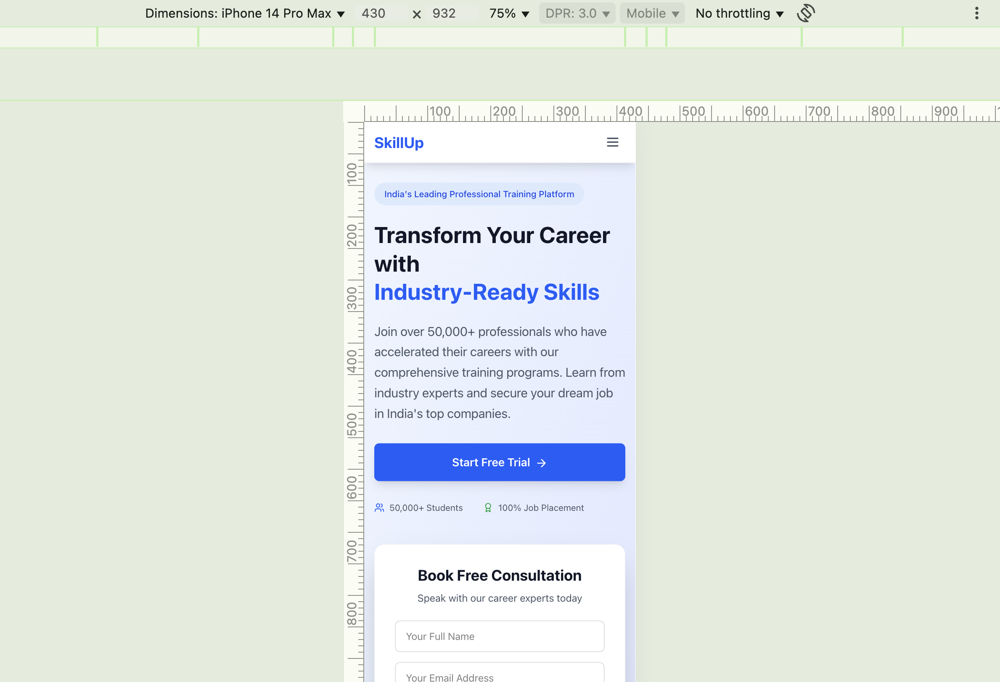

# 🌟 SkillUp – Career Training Landing Page


Live Link: https://riseskillup.netlify.app/

=======
A responsive and visually appealing **Landing Page** for "SkillUp" – India’s leading professional training platform. This landing page is designed to attract users, showcase services, and encourage them to sign up for consultations.

---

## 📋 Project Description

The landing page promotes SkillUp's career training programs and includes:
- A bold headline and subtext to attract users
- A **consultation form** for user lead capture
- Call-to-action buttons like “Start Free Trial” and “Book Free Consultation”
- Mobile responsive layout using **Flexbox** and **media queries**
- Trust-building metrics (e.g., 50,000+ students, 100% job placement)

---

## 🛠️ Tech Stack

- HTML5
- CSS3
- JavaScript (Optional for form interaction)
- Tailwind CSS (or Vanilla CSS based on your project)
- React js
- Responsive Web Design

---

## Screen Recordings


## 🖥️ Desktop View


---

## 📱 Mobile View



---

## 🚀 How to Run Locally

1. Clone the repository:
```bash
git clone https://github.com/your-username/skillup-landing-page.git

2. Navigate to the project folder:

cd skillup-landing-page

3. Open index.html in your browser or use Live Server in VS Code

npm run dev

**Features**

Fully responsive landing layout
Conversion-focused form section
Eye-catching call-to-action buttons
Clean and modern UI design
Mobile-optimized navigation and layout

**Folder Structure**

skillup-landing-page/
├── public/
│   └── index.html
├── src/
│   ├── components/
│   │   ├── HeroSection.jsx
│   │   ├── CTAForm.jsx
│   │   └── Header.jsx
│   ├── forms/
│   │   └── ConsultationForm.jsx
│   ├── layout/
│   │   └── MainLayout.jsx
│   ├── sections/
│   │   ├── Home.jsx
│   │   ├── Services.jsx
│   │   └── Contact.jsx
│   ├── ui/
│   │   ├── Button.jsx
│   │   ├── InputField.jsx
│   │   └── Dropdown.jsx
│   ├── data/
│   │   └── servicesData.js
│   ├── hooks/
│   │   └── useFormValidation.js
│   ├── App.js
│   └── index.js
├── screenshots/
│   ├── skillup-desktop-view.png
│   └── skillup-mobile-view.png
├── tailwind.config.js (if used)
├── package.json
└── README.md


**Author**

Vignesh – Java Full Stack Developer
This project was created as part of the RISE Internship 2025


**License**

This project was created as part of the RISE Internship 2025
For educational and portfolio purposes only
No commercial license attached.
